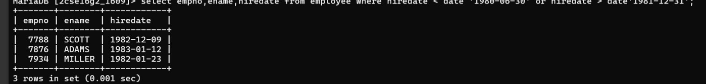

## Question 1
Display the list of employees who have joined the company before 30th June 1980 or after 31st Dec 1981.

### Query
```sql
SELECT * 
FROM emp 
WHERE hiredate < '30-JUN-80' OR hiredate > '31-DEC-81';
```

### Output
List of employees satisfying the date condition.
