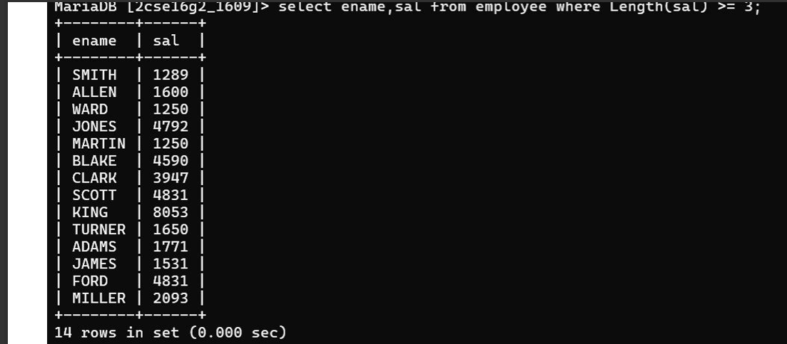

## Question 10
Display those employees whose salary contains at least 3 digits.

### Query
```sql
SELECT * 
FROM emp 
WHERE sal BETWEEN 100 AND 9999;
```

### Output
Employees having salary with at least 3 digits.

