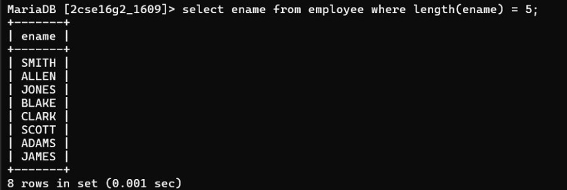

## Question 3
Display the names of employees whose name is exactly five characters in length.

### Query
```sql
SELECT ename 
FROM emp 
WHERE LENGTH(ename) = 5;
```

### Output
Names having exactly 5 characters.
