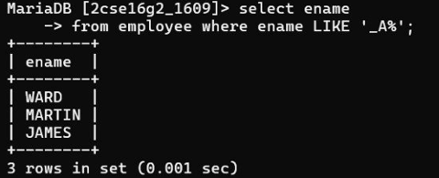

## Question 4
Display the names of employees whose names have second alphabet A.

### Query
```sql
SELECT ename 
FROM emp 
WHERE ename LIKE '_A%';
```

### Output
Names where second character is 'A'.
