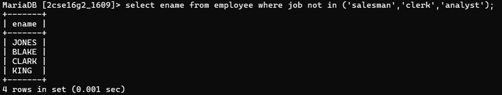

## Question 5
Display the names of employees who are not working as salesman or clerk or analyst.

### Query
```sql
SELECT ename 
FROM emp 
WHERE job NOT IN ('SALESMAN', 'CLERK', 'ANALYST');
### Output
Names excluding given job roles.


