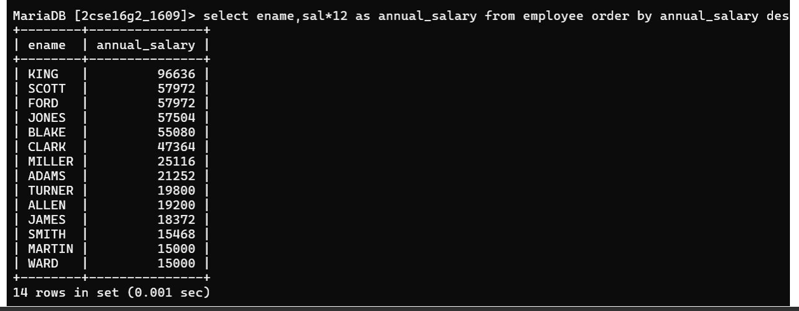

## Question 6
Display the name of the employee along with their annual salary (sal*12). The name of the employee earning highest salary should appear first.

### Query
```sql
SELECT ename, sal*12 AS annual_salary 
FROM emp 
ORDER BY annual_salary DESC;
```

### Output
Employee names with annual salary sorted descending.

