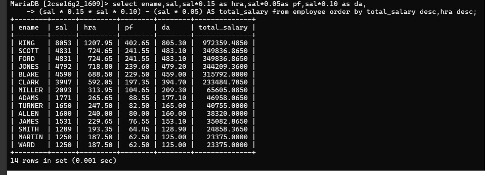

## Question 7
Display name, sal, hra, pf, da, totalsal for each employee.  
hra = 15% of sal  
da = 10% of sal  
pf = 5% of sal  
totalsal = (sal + hra + da) - pf  

### Query
```sql
SELECT ename, 
       sal, 
       sal*0.15 AS hra, 
       sal*0.10 AS da, 
       sal*0.05 AS pf, 
       (sal + (sal*0.15) + (sal*0.10) - (sal*0.05)) AS totalsal
FROM emp
ORDER BY totalsal;
```

### Output
Employee salary breakdown with calculated fields.

