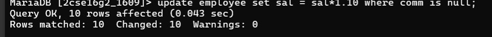

## Question 8
Update the salary of each employee by 10% increment who are not eligible for commission.

### Query
```sql
UPDATE emp 
SET sal = sal * 1.10 
WHERE comm IS NULL;
```

### Output
Salary updated for employees without commission.

