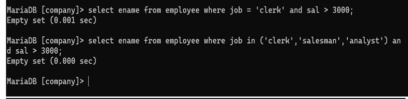

## Question 9
Display those employees whose salary is more than 3000 after giving 20% increment.

### Query
```sql
SELECT * 
FROM emp 
WHERE sal * 1.20 > 3000;
```

### Output
Employees whose updated salary exceeds 3000.
