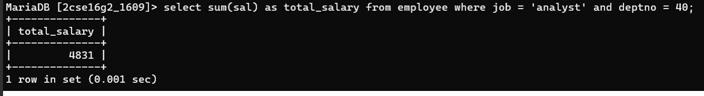

10. Display the total salary drawn by analyst working in dept no 40.

Query:

SELECT SUM(sal) AS total_salary 
FROM employee 
WHERE job = 'ANALYST' AND deptno = 40;

Output:

TOTAL_SALARY
--------------------
4831

