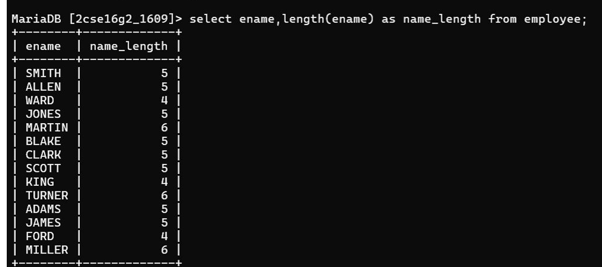

15. Display the length of all the employee names.

Query:

SELECT ename, LENGTH(ename) AS name_length FROM employee;

Output:

ENAME   NAME_LENGTH
------  -----------
SMITH   5
ALLEN   5
WARD    4
...

