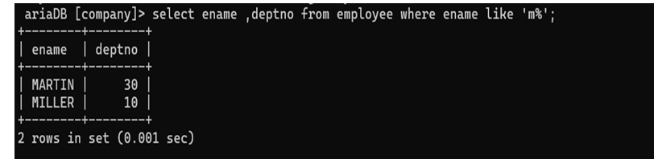

## 10. List Name and Department Number of employee whose names began with M.

### Query
```sql
SELECT ename, deptno FROM Employee 
WHERE ename LIKE 'M%';
```

### Output
Displays employee names starting with 'M' along with their department numbers.
