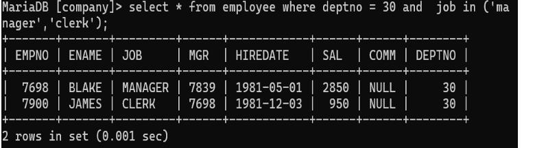

## 4. Find all information about all the managers as well as the clerks in department 30.

### Query
```sql
SELECT * FROM Employee 
WHERE deptno = 30 AND (job = 'MANAGER' OR job = 'CLERK');
```

### Output
Displays details of managers and clerks working in department 30.
