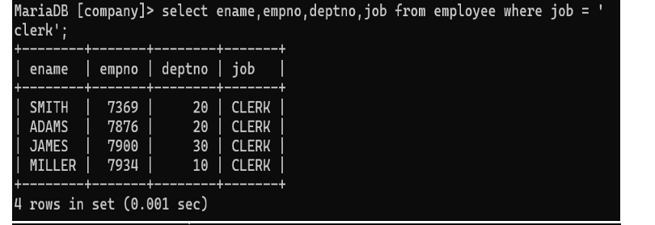

## 5. List the Employee name, Employee numbers and department of all clerks.

### Query
```sql
SELECT ename, empno, deptno FROM Employee WHERE job = 'CLERK';
```

### Output
Displays employee name, employee number, and department number of all clerks.
