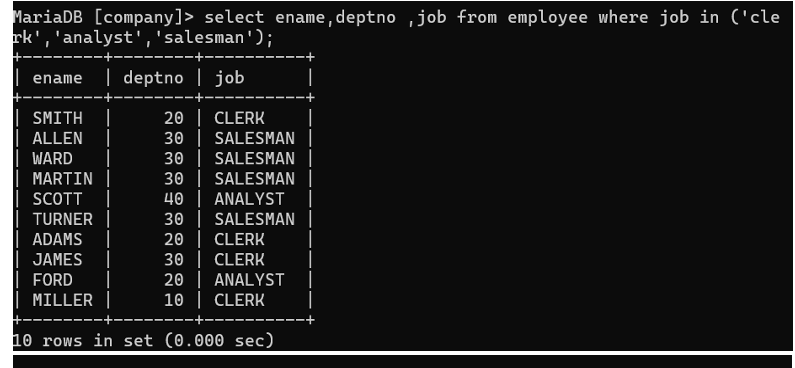

## 9. List Name and Department Number of employee who are clerks, analyst or salesman.

### Query
```sql
SELECT ename, deptno FROM Employee 
WHERE job IN ('CLERK', 'ANALYST', 'SALESMAN');
```

### Output
Displays employee names and department numbers for specified job roles.
