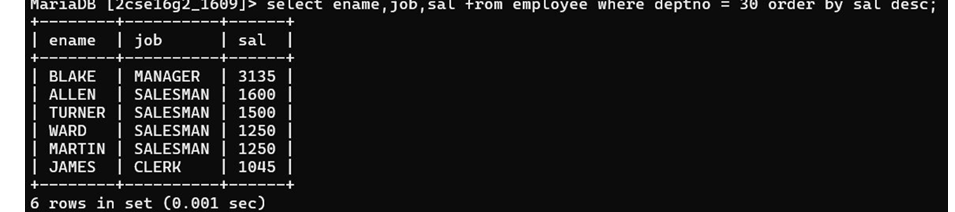

## 1. List all employees and jobs in Department 30 in descending order by salary.

### Query
```sql
SELECT ename, job, sal FROM Employee 
WHERE deptno = 30 
ORDER BY sal DESC;
```

### Output
Displays employee names, jobs, and salaries in department 30 sorted in descending order of salary.
