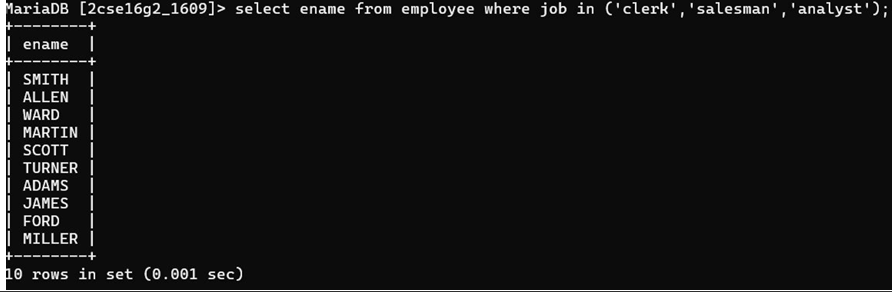

## 10. Display the names of employees who are working as clerk, salesman or analyst and drawing a salary more than 3000.

### Query
```sql
SELECT ename FROM Employee 
WHERE job IN ('CLERK', 'SALESMAN', 'ANALYST') 
AND sal > 3000;
```

### Output
Displays names of employees in specified roles earning more than 3000.
