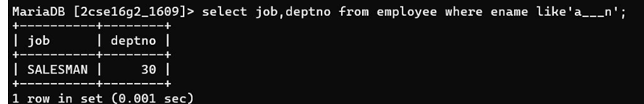

## 2. List job and Department Number of employees whose name are five letters long begin with “A” and end with “N”.

### Query
```sql
SELECT job, deptno FROM Employee 
WHERE ename LIKE 'a___n';
```

### Output
Displays job and department number of employees whose names have exactly five letters starting with A and ending with N.
