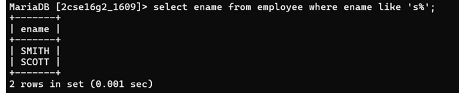

## 3. Display the name of employees whose name start with alphabet S.

### Query
```sql
SELECT ename FROM Employee 
WHERE ename LIKE 'S%';
```

### Output
Displays names of employees starting with the letter S.
