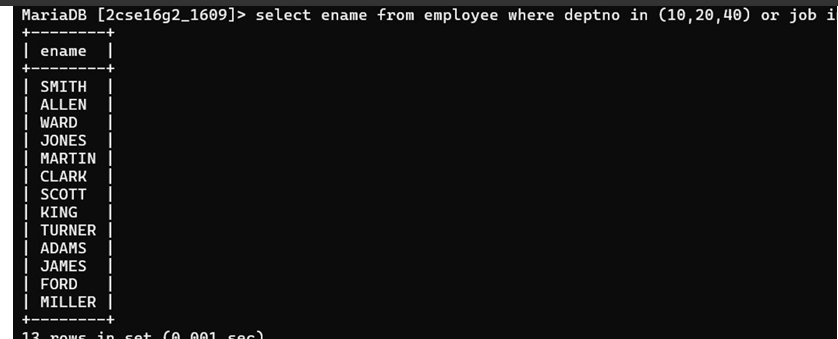

## 5. Display the names of employees working in department number 10 or 20 or 40 or employees working as clerks, salesman or analyst.

### Query
```sql
SELECT ename FROM Employee 
WHERE deptno IN (10, 20, 40) 
   OR job IN ('CLERK', 'SALESMAN', 'ANALYST');
   ### Output
Displays names of employees who satisfy either department or job conditions

