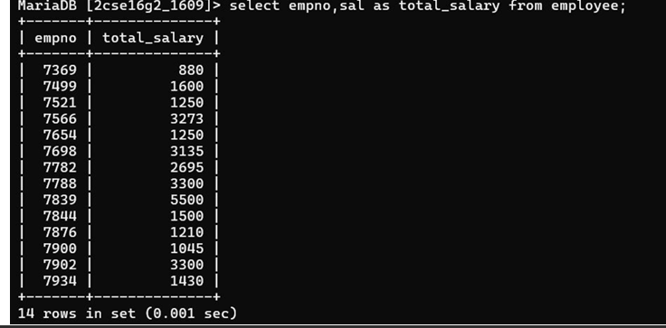

## 7. Display employee number and total salary for each employee.

### Query
```sql
SELECT empno,sal as total_salary from employee; 
FROM Employee;
```

### Output
Displays employee number and total salary including commission.

