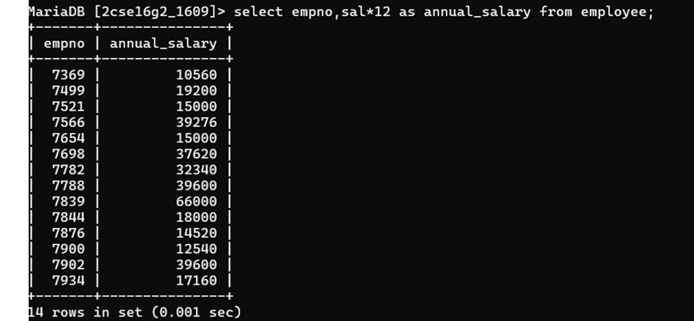

## 8. Display employee number and annual salary for each employee.

### Query
```sql
SELECT empno, (sal * 12) AS annual_salary 
FROM Employee;
```

### Output
Displays employee number and annual salary calculated from monthly salary.

