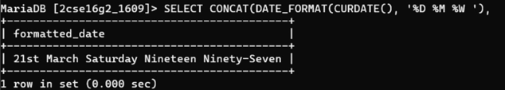

## 4. Display current date in full format

### Query
```sql
SELECT CONCAT(DATE_FORMAT(CURDATE(), '%D %M %W'),'Nineteen Ninety') as output;
```

### Output
| DATE |
|------|
| 21nd March Sunday 2026 |

