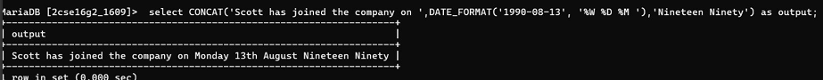

## 5. Display formatted output for each employee

### Query
```sql
SELECT CONCAT('Scott has joined the company on ,'DATE_FORMAT('1990-08-13','%W %D %M'),'Nineteen Ninety') as output;

### Output
| RESULT |
|--------|
| Scott has joined the comapny on Monday 13th August Nineteen Ninety |


