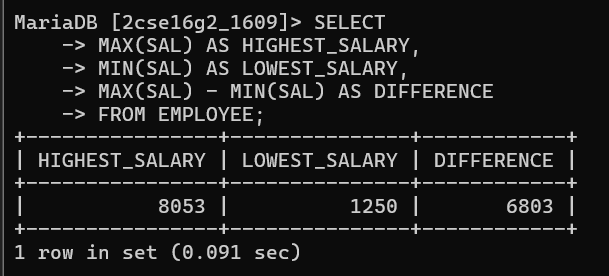

# 2. Find the highest and lowest salaries and the difference between them.
 
SELECT 
MAX(SAL) AS HIGHEST_SALARY,
MIN(SAL) AS LOWEST_SALARY,
MAX(SAL) - MIN(SAL) AS DIFFERENCE
FROM EMPLOYEE;

# output

