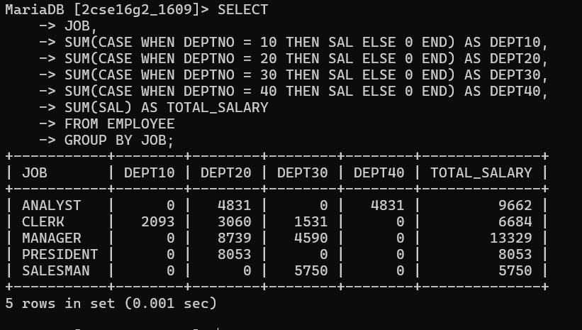

# Create a matrix query to display the job, the salary for that job based on department number, and the total salary for that job for all departments, giving each column an appropriate heading.

SELECT 
JOB,
SUM(CASE WHEN DEPTNO = 10 THEN SAL ELSE 0 END) AS DEPT10,
SUM(CASE WHEN DEPTNO = 20 THEN SAL ELSE 0 END) AS DEPT20,
SUM(CASE WHEN DEPTNO = 30 THEN SAL ELSE 0 END) AS DEPT30,
SUM(CASE WHEN DEPTNO = 40 THEN SAL ELSE 0 END) AS DEPT40,
SUM(SAL) AS TOTAL_SALARY
FROM EMPLOYEE
GROUP BY JOB;

# output

