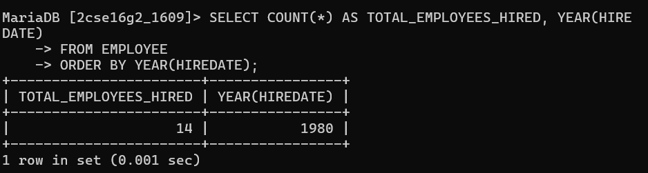

# Query that will display the total no of employees, and of that total the number who were hired in 1980,1981,1982 and 1983. Give appropriate column heading.

SELECT COUNT(*) AS TOTAL_EMPLOYEES_HIRED, YEAR(HIREDATE)
FROM EMPLOYEE
ORDER BY YEAR(HIREDATE);

# output

