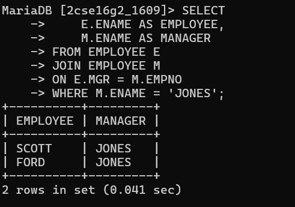

 # Display those employees whose manager names is jones, and also display their manager name.

SELECT A.ENAME AS EMPLOYEE_NAME, B.ENAME AS MANAGER_NAME
FROM EMPLOYEE A, EMPLOYEE B
WHERE A.MGR = B.EMPNO
AND B.ENAME = 'JONES';

# output

