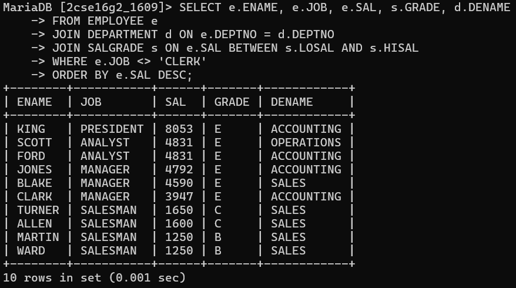

# List out all the employees name, job, and salary grade and department name for everyone in the company except ‘clerk’. Sort on salary display the highest salary.

SELECT e.ENAME, e.JOB, e.SAL, s.GRADE, d.DNAME
FROM EMPLOYEE e
JOIN DEPARTMENT d ON e.DEPTNO = d.DEPTNO
JOIN SALGRADE s ON e.SAL BETWEEN s.LOSAL AND s.HISAL
WHERE e.JOB <> 'CLERK'
ORDER BY e.SAL DESC;

# output

