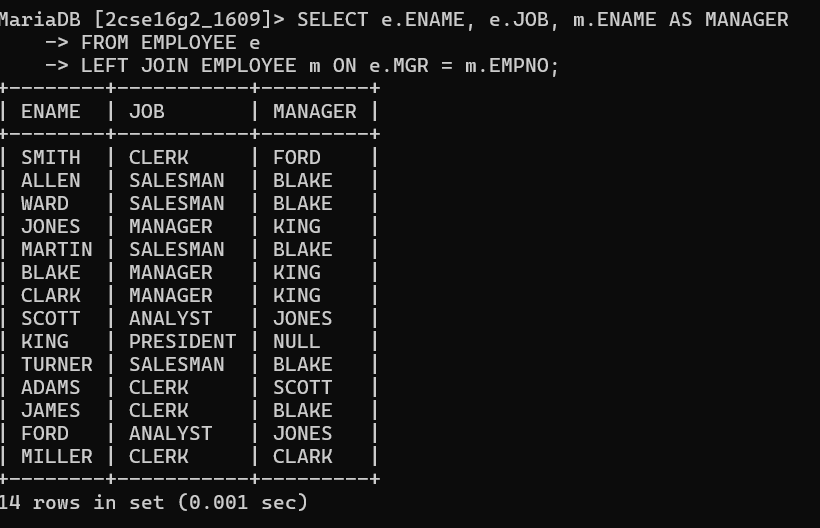

#  Display employee name, his job and his manager. Display also employees who are without manager.

SELECT e.ENAME, e.JOB, m.ENAME AS MANAGER
FROM EMPLOYEE e
LEFT JOIN EMPLOYEE m ON e.MGR = m.EMPNO;

# output

