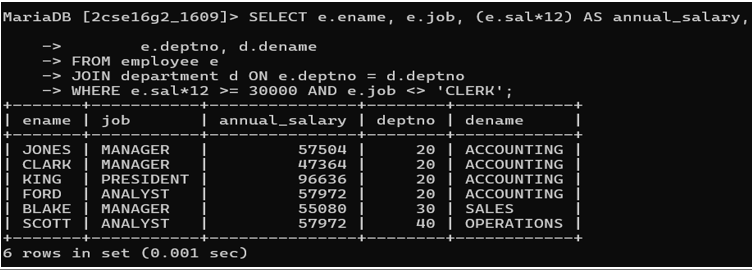

# List ename, job, annual sal, deptno, dname and grade who earn 30000 per year and who are not clerks.

SELECT e.ename, e.job,(e.sal*12) AS annual_salary,
e.deptno, d.dename
FROM employee e
JOIN department d ON e.deptno = d.deptno
WHERE e.sal *12 >= 30000 AND e.job <> 'CLERK;

# output
