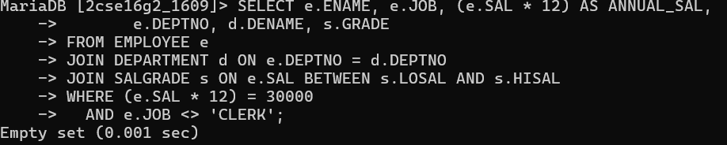

# List ename, job, annual sal, deptno, dname and grade who earn 30000 per year and who are not clerks.

SELECT e.ENAME, e.JOB, (e.SAL * 12) AS ANNUAL_SAL,
       e.DEPTNO, d.DNAME, s.GRADE
FROM EMPLOYEE e
JOIN DEPARTMENT d ON e.DEPTNO = d.DEPTNO
JOIN SALGRADE s ON e.SAL BETWEEN s.LOSAL AND s.HISAL
WHERE (e.SAL * 12) = 30000
  AND e.JOB <> 'CLERK';

# output 

