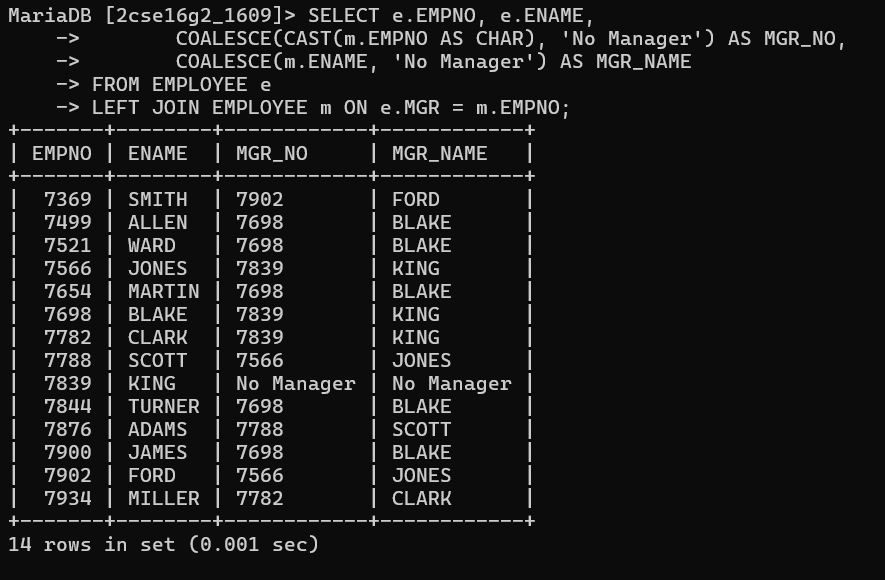

# List out all employees by name and number along with their manager’s name and number also display ‘no manager’ who has no manager.

SELECT e.EMPNO, e.ENAME,
       COALESCE(CAST(m.EMPNO AS CHAR), 'No Manager') AS MGR_NO,
       COALESCE(m.ENAME, 'No Manager') AS MGR_NAME
FROM EMPLOYEE e
LEFT JOIN EMPLOYEE m ON e.MGR = m.EMPNO;

# output

